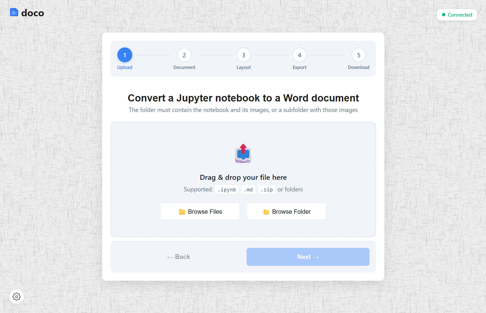

# doco



A self-hosted web application that converts Jupyter notebooks (`.ipynb`) and Markdown (`.md`) files into professionally styled Word documents (`.docx`), with optional HTML and Markdown exports.

## Features

- **Notebook & Markdown support** — upload `.ipynb`, `.md`, `.zip`, or entire folders with images
- **Styled DOCX output** — configurable fonts, sizes, alignment, page layout, headers, footers, and table of contents
- **Code block formatting** — grey background, monospace font, optional hide/show
- **Table styling** — blue accent header rows, borders, auto-fit to page width
- **Image handling** — auto-resize to page width, figure caption detection
- **Additional exports** — optional HTML report and intermediate Markdown
- **Real-time progress** — WebSocket-based status updates during conversion
- **Self-cleaning** — uploaded and output files are automatically deleted after use

## Installation

### Docker (recommended)

The easiest way to run doco is to pull the pre-built image:

```bash
docker run -d -p 8678:8678 --name doco logus2k/doco:latest
```

Then open **http://localhost:8678** in your browser.

To stop and remove the container:

```bash
docker stop doco && docker rm doco
```

### Docker Compose

If you prefer using the included compose setup:

```bash
cd compose
./start.sh       # Linux / macOS
start.bat        # Windows
```

This creates the Docker network, builds the image, and starts the container on port **8678**.

To stop:
```bash
cd compose
./stop.sh       # Linux / macOS
stop.bat        # Windows
```

### Run from Source

**Prerequisites:**
- Python 3.12+
- Pandoc installed and available on PATH ([pandoc.org/installing](https://pandoc.org/installing.html))

**Steps:**

1. **Create a virtual environment and install dependencies:**

   ```bash
   python -m venv .venv_doco
   source .venv_doco/bin/activate   # Linux / macOS
   # .venv_doco\Scripts\activate    # Windows
   pip install -r requirements.txt
   ```

2. **Run the server:**

   ```bash
   uvicorn main:socket_app --host 0.0.0.0 --port 8678
   ```

3. Open **http://localhost:8678** in your browser.

## Usage

The web interface is a 5-step wizard:

1. **Upload** — drag & drop or browse for a `.ipynb`, `.md`, `.zip`, or a folder containing a notebook/markdown and its assets (images)
2. **Document Options** — hide code inputs, keep text outputs, include table of contents, select paper size (A4 / Letter)
3. **Layout & Styling** — configure header text, page number position, font family, font sizes (body, table, code, header), text alignment, image/table resizing
4. **Export Options** — optionally export HTML and/or Markdown alongside the DOCX
5. **Download** — download the converted files

## Project Structure

```
doco/
├── main.py                  # FastAPI server, upload/download routes, Socket.IO events
├── document_converter.py    # Conversion pipeline (nbconvert → Pandoc → python-docx styling)
├── requirements.txt         # Python dependencies
├── static/
│   ├── index.html           # Wizard UI
│   ├── css/style.css        # Styles
│   └── js/
│       ├── app.js           # Wizard controller
│       ├── services/
│       │   └── SocketService.js
│       └── components/
│           ├── FileUploader.js
│           ├── ProgressTracker.js
│           └── CSSReloader.js
├── compose/
│   ├── doco.Dockerfile
│   ├── docker-compose-cpu.yml
│   ├── start.sh / start.bat
│   ├── stop.sh / stop.bat
│   ├── update.sh / update.bat
│   ├── rebuild_all.sh / rebuild_all.bat
│   └── remove_all.sh / remove_all.bat
├── uploads/                 # Temporary upload storage (auto-cleaned)
└── outputs/                 # Temporary output storage (auto-cleaned)
```

## How It Works

1. Files are uploaded via REST and stored in a UUID-based session directory
2. The frontend sends a `start_conversion` WebSocket event with the file ID and user-selected options
3. The backend runs the conversion in a thread pool:
   - **Notebooks**: read with `nbformat`, clean outputs, export to intermediate Markdown via `nbconvert`
   - **Markdown preprocessing**: strip image captions, remove HRs after H1 headers, style figure captions
   - **Pandoc** converts Markdown to DOCX (with optional TOC)
   - **python-docx** post-processes the DOCX: page layout, margins, headers/footers, typography, code block styling, table formatting, image resizing
4. Progress updates are emitted over WebSocket in real time
5. The converted file is served via a streaming download endpoint that deletes the file after transfer

## Configuration Options

| Option | Default | Description |
|---|---|---|
| Hide Code | `true` | Remove code cell inputs from output |
| Keep Text | `false` | Preserve text outputs from code cells |
| Table of Contents | `true` | Add TOC at the beginning |
| Paper Size | A4 | A4 or Letter |
| Font Family | Aptos | Aptos, Arial, Calibri, Cambria, Times New Roman |
| Body Font Size | 12pt | Main text size |
| Table Font Size | 11pt | Table cell text size |
| Code Font Size | 10pt | Code block text size |
| Header Font Size | 9pt | Page header/footer text size |
| Text Alignment | Justify | Justify or Left |
| Resize Images | `true` | Fit images to page width |
| Resize Tables | `true` | Fit tables to page width |
| Page Number | Right | Left, Center, or Right |
